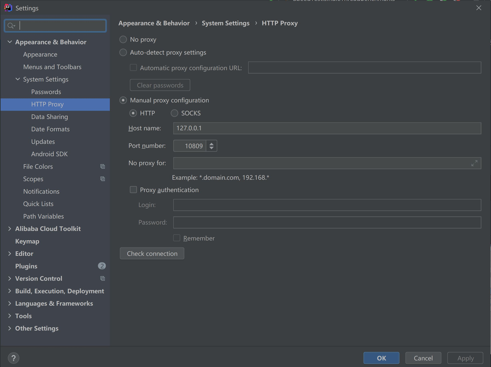
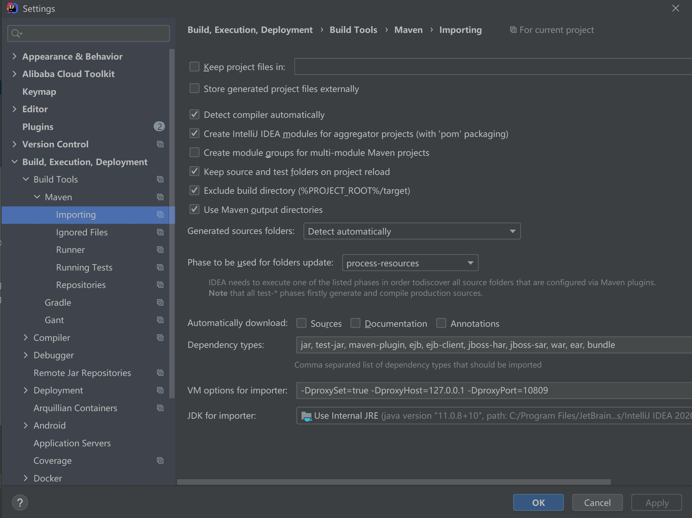
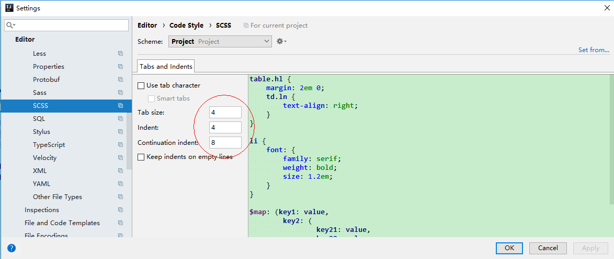
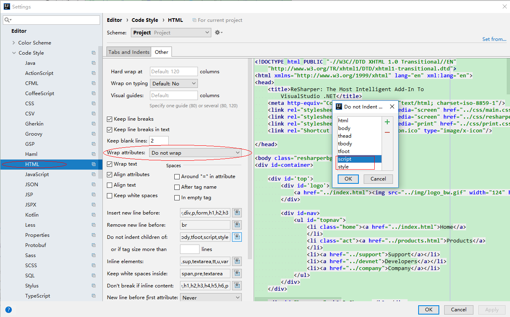
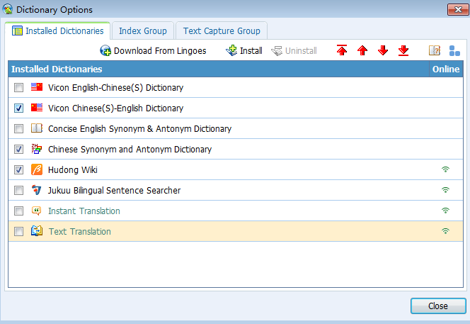
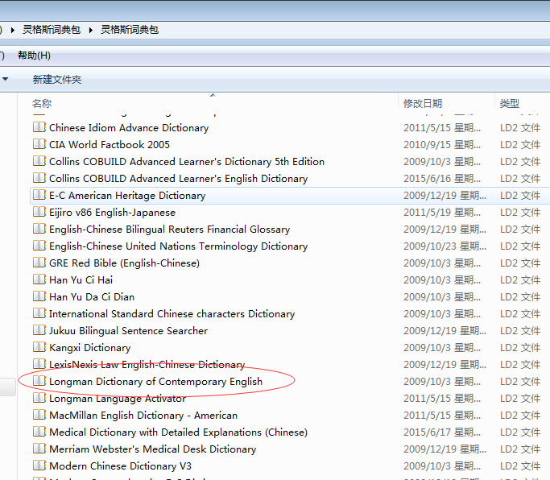

# 第1节：Intellij IDEA 环境安装

>沉淀、分享、成长，让自己和他人都能有所收获！😄

## 1. Java安装

```
安装JDK11
配置环境变量：JAVA_HOME      D:\Java\JDK    （JDK安装的目录，既bin层之上的目录）
              Path            %JAVA_HOME%\bin   （通过JAVA_HOME确定bin的目录）
在cmd命令中运行：java -version ,有结果返回则表示安装成功
```

## 2. git使用默认的安装，选择git bash only

```
安装好以后，在git bash中输入：git --version，有结果返回则表示安装成功
```

- git下载代码慢的解决方法|无法下载代码的解决方法

```
使用vpn
git config --global http.proxy http://127.0.0.1:10809
git config --global https.proxy https://127.0.0.1:10809
```

- 换行符

```
提交时转换为LF，检出时不转换，强烈推荐设置，可以减少不同电脑和不同系统之间切换，导致换行符不统一的问题
git config --global core.autocrlf input
```

## 3. nodejs安装

- 直接默认安装

```
查看npm是否安装成功：npm --version；  
查看nodejs是否安装成功：node --version；
```

- 在package.json文件右键,npm install安装依赖包

```
使用npm install安装需要的node module
安装完成后，在node module，和static上右键->mark Directory as->excluded
然后，File->Invalidate Cache/Restart
```

## 4. mongodb

1. 直接安装MongoDB，用custom自定义安装目录，一般用默认的安装目录即可，不要勾选mongoDB compass
2. 将D:\Tools\MongoDB\Server\4.2\bin配置到环境变量中，便于全局使用
3. mongo -version # 查看安装的版本

## 5. idea，mongodb，postman

## 6. 中间件安装

- zookeeper安装，解压过后，直接运行zkServer.md，zookeeper运行需要依赖JAVA_HOME环境变量

## 7. rider安装


# 第2节：Intellij IDEA 相关设置

## 1 参数配置：Help->edit custom

- 自定义idea参数，edit custom properties

````
# 控制台输出缓存，如果不使用下面的参数，也可以在Setting->Editor->General->Console中设置
# idea.cycle.buffer.size=disabled
# 设置可读文件大小
idea.max.intellisense.filesize=50000
````

- 自定义jvm参数，edit custom vm operation

```
-Xms1024m
-Xmx8192m
-XX:ReservedCodeCacheSize=512m


-Dfile.encoding=UTF-8
-Duser.name=jaysunxiao
```

## 2 界面设置和编码设置（需要上面两步做完）

- 文件编码设置：File->Settings->Editor->File Encodings

```
Global Encoding:UTF-8
Projectt Encoding:UTF-8
Default encoding for properties files:UTF-8
BOM for utf8: No Bom
```

## 3 换行符设置

- 统一用Unix换行符：File->Settings->Editor->Code Style

```
Line separator，Unix and MacOs （\n）
```

## 4 代码模板设置

- 设置类模板：Editor->File and Code Templates->Includes

```
/**
 * @author Huc.Leiou
 * @version 1.0
 */
```

- 版权信息设置：Editor->Copyright->Copyright Profiles

```
Copyright (C) 2020
Licensed under the Apache License, Version 2.0 (the "License"); you may not use this file except
in compliance with the License. You may obtain a copy of the License at

http://www.apache.org/licenses/LICENSE-2.0

Unless required by applicable law or agreed to in writing, software distributed under the License is distributed
on an "AS IS" BASIS, WITHOUT WARRANTIES OR CONDITIONS OF ANY KIND, either express or implied.
See the License for the specific language governing permissions and limitations under the License.
```

# 5 代理设置

- idea代理设置
  

- maven代理设置（非全局），-DproxySet=true -DproxyHost=127.0.0.1 -DproxyPort=10809
  


## 6 使用Idea默认的快捷键设置

- eclipse快捷键设置，个人习惯

```
Keymap->Main menu->Code->Completion->Basic，删除ctrl+空格，设置为ctrl+enter
Run to Cursor，设置为F9
find，设置为ctrl+f
replace，设置为alt+f
在输入法上右键，将win10的简体繁体切换ctrl+f快捷键键取消
```

### 4.2 服务器插件安装

- Cyan Light Theme主题插件，个人习惯
- zoolytic，zookeeper客户端管理插件，推荐下载
- vue.js，vue语法识别，推荐下载
- jclasslib，字节码查看工具，推荐下载
- Maven Helper，maven依赖查看工具，推荐下载

- Alibaba Java Coding Guidelines
- Alibaba Cloud tool
- Power Mode 2
- EasyApi


### 4.3 web插件安装

- eslint
  


## 4.4 格式设置，个人习惯

- CSS格式设置
- SCSS格式设置
  

- JSON格式设置
  

- HTML格式设置
- XML格式设置
- VUE格式设置
  
  

## 5.Lingoes安装

- 在电脑管家上下载也可以，直接默认安装
  
  
  

```
在下面的文件夹下，将Lingoes English.zip解压到这个目录下
C:\Users\Administrator\AppData\Local\Lingoes\Translator\user_data\speech
重启Lingoes，在设置->语言中，选择声音，英语
```


# 第2节：Intellij IDEA 代理设置

## 1.解决Plugins和Dependencies拉取不到jar包，项目报红

找到安装目录E:\Tools\IntelliJ IDEA 2021.1.3\plugins\maven\lib\maven3\conf\settings.xml
```
<mirrors>
  <!--配置华为云Maven镜像-->
    <mirror>
      <id>huaweicloud</id>
      <name>华为云 maven</name>
      <mirrorOf>*</mirrorOf>
      <url>https://mirrors.huaweicloud.com/repository/maven/</url>
    </mirror>
     <!--配置阿里云Maven镜像-->
     <mirror>
      <id>aliyunmaven</id>
      <mirrorOf>*</mirrorOf>
      <name>阿里云公共仓库</name>
      <url>https://maven.aliyun.com/repository/public</url>
     </mirror>
     <!--配置腾讯云Maven镜像-->
     <mirror>
      <id>nexus-tencentyun</id>
      <mirrorOf>*</mirrorOf>
      <name>Nexus tencentyun</name>
      <url>http://mirrors.cloud.tencent.com/nexus/repository/maven-public/</url>
     </mirror>
</mirrors>
```